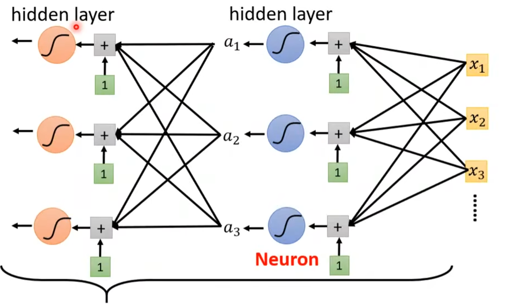
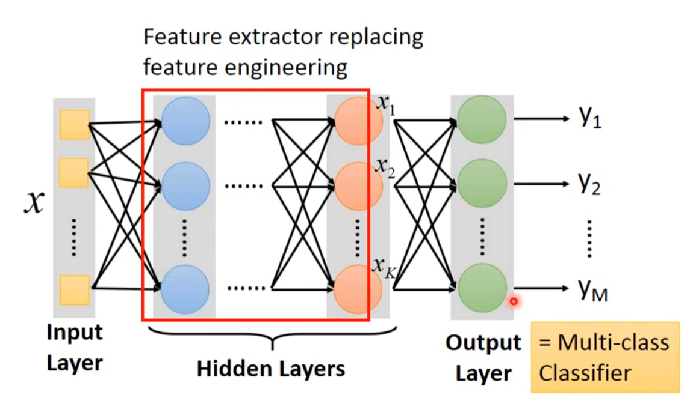
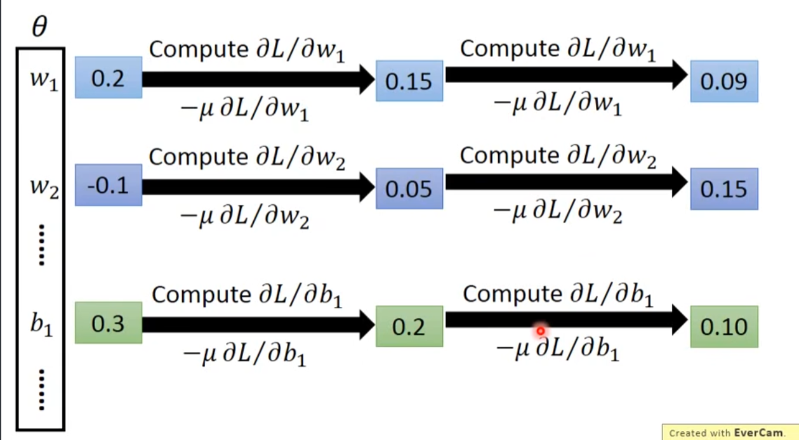
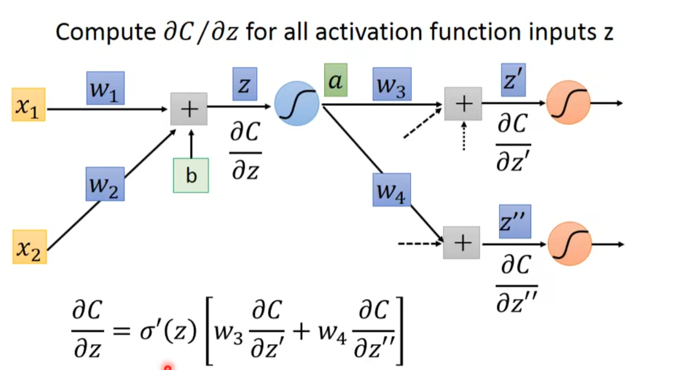

# Machine Learning (Hung-yi Lee)

[TOC]

## **Preface**

Machine Learning is like looking for function. This course focuses on Deep Learning,it has different types of Functions,inputs and outputs. For example ,inputs may include vector ,Matrix (e.g., image),Sequence(e.g.,speech,text) ,and outputs may include a scalar (which learning called regression),categories(called classification),texts ,  images and so on.

## **Chapter one     Basic concepts of machine learning**

Machine Learning is like looking for function.

### Different types of functions

(1) **Regression**: The function outputs a scalar.

(2) **Classification**: Given options (classes), the function outputs the correct one.

Not only the two types but also has it structured Learning，which means the learning needs to create something with structure (image,document). 

### The training method of Machine learning

1.**Function with unknown parameters**

(of course, it's based on domain knowledge)we need to know the unknown parameters. For example,$y=wx_1+b$，**$x_1$** is called **feature** , $w$ is called **weight** and **b** is called **bias**.

2.**Define Loss from training Data:**

 Firstly, we should know that **Loss** is a function of parameters, like $L(b,w)$. And the Loss shows how good a set of value is . $L=\frac1 N\sum e_i$  (P. S. **Label** is the real  sample values.) if we use the formula $e=\abs{y-\hat y}$ , the Loss that we get finally is Mean Absolute Error (MAE). But if we use the formula $e=({y-\hat y})^2$ , the Loss that we get finally is Mean Square Error (MSE). While $y$ and $\hat y$ are both probability distributions , we will choose the method "Cross-entropy".(we will later mention it.) 

According to different parameters, we can get different Loss values. We can draw a  equal Loss plot according to different Loss values, which is called **Error Surface**.

3.**Optimization**

we find the parameters which can make the Loss get minimum. We use the method of **Gradient Descent**. In this way, firstly we randomly pick an initial value of parameters , then we calculate the differentiation of the function under this parameter. According to the differentiation,we choose to increase or decrease parameters' value and the step of our increment or decrement. 

We use  $\eta \frac{\partial L}{\partial w}|_{w=w^0}$  to describe the step of our increment or decrement, in this $\eta$ is called learning rate(**hyper-parameters**,which are parameters defined by yourself in Machine Learning ) ,after that we update parameters iteratively. Until we find values of parameters which makes the value of differentiation equal zero (But unfortunately a function maybe have different stationary points ) we finish calculating and print the answer. 

We call the Loss that gets minimum **Global minima** , and others which  differentiation equal zero is called **Local minima** So this method may be considered as a not very accurate way to find the Loss minimum by some persons , but in fact Local minima doesn't cause the problem in practical problem , and this method is the a relative-correct way. But sometimes the training result doesn't conform to the real situation , we can add more parameters to improve the training.

Linear models are too simple and have severe limitations... so we need more sophisticated and flexible models. We call the models' limitations  **Model Bias**. All  Piecewise Linear Curves  in fact equal one constant and sum of a set of Sigmoid function. 

The more pieces require more Sigmoid function. If curves are beyond Piecewise Linear ,we can choose some points to make curves  to be approximate continuous curves. To have good approximation, we need sufficient pieces.  **$y=c\frac{1}{1+e^{-(b+wx_1)}}=c\ \ sigmoid(b+wx_1)$** represents the **Sigmoid function**. 

Different $w$ change slopes, different $b$ shift the function,and different c change the height of function. So the final function maybe becomes $y=b+\sum c_i\ sigmoid(b_i+w_ix_1)$. If the function have more features ,the function becomes $y=b+\sum_i c_i\ sigmoid(b_i+\sum_jw_{ij}x_j)$.It can be reduced to the following form:($x$ is the feature, $W,B,b,C^T$ are unknown parameters.)
$$
\left[\begin{array}{l}
r_{1} \\
r_{2} \\
r_{3}
\end{array}\right]=\left[\begin{array}{l}
b_{1} \\
b_{2} \\
b_{3}
\end{array}\right]+\left[\begin{array}{lll}
w_{11} & w_{12} & w_{13} \\
w_{21} & w_{22} & w_{23} \\
w_{31} & w_{32} & w_{33}
\end{array}\right]\left[\begin{array}{l}
x_{1} \\
x_{2} \\
x_{3}
\end{array}\right] ,\\y=B+C^T\cdot \sigma(b+W x)
$$
If we Combine the row vectors of these parameters——$W,B,b,C^T$ and convert them into a whole column vector matrix rows. We call the column vector matrix rows Matrix $\theta$. So Loss is a function of parameters $L(\theta)$

Now we start optimization of New Model: we call the $\theta$ that can make the Loss minimum $\theta^*$.Firstly ,still randomly pick initial value $\theta^0$, and we calculate the gradient $g=\nabla L(\theta^0)$ ,  then we calculate $\theta^1\leftarrow\theta^0-\eta g$ . We select different  row vectors of  parameters (batch) to calculate gradient of different batches.

For more models ,we can also choose different functions. For example , we can choose **Rectified Linear Unit** ( ReLU ):$c \max \left(0, b+w x_{1}\right)$, so the $y=b+\sum_i c_i\ max(b_i+\sum_jw_{ij}x_j)$ .In Machine Learning,  we call the function like sigmoid, max **Activation function**.



We called this network that mimics human brains **Neural Network** .Many layers means Deep Learning. We always want "Deep" network not "Fat" network. If we get better on training data ,but get worse on unseen data , we call this phenomenon **Overfitting** .

## (Elective) Deep Learning

### Three steps for deep learning :

Step 1:define a set of function

Neural Network: Different connection leads to different network structures Network parameter $\theta$ :all the weights and biases in the "neurons".

### Fully Connect Feedforward Network 

Each neuron of the received signal receives the input of all neurons in the upper layer.



This is a function. So if you give a input vector to it and it will output a vector. So the network structure defines a function set. You need to decide the network structure to let a good function in your function set.

 The structure can be automatically determined. E .g. Evolutionary Artificial Neural Networks. And we can design the network structure by Convolutional Neural Network (CNN).

Step 2: goodness of function

Give a set of parameters and calculate the loss. Find a function in function set that minimizes total loss L . In fact , we find the network parameters $\theta^*$ that minimize total loss. 



Step 3: pick the best function

Deeper is better? Any continuous function f can be realized by a network with one hidden layer (given **enough** hidden neurons)


## (Elective) Backpropagation

### Gradient Descent

Network parameters $\theta=\{ w_1,w_2,\cdots,b_1,b_2,\cdots\}$.Firstly,choose one starting parameters $\theta^0$ .Secondly,compute $\nabla L(\theta^0)$，Thirdly , compute $\theta^1=\theta^0-\eta\nabla L(\theta ^0)$ .After that back to the first step ,...So it's too difficult ,we use backpropagation to comput the gradients efficiently.

### Chain Rule

Case 1 : $\quad y=g(x) \quad z=h(y) ,\Delta x \rightarrow \Delta y \rightarrow \Delta z ,\quad \frac{d z}{d x}=\frac{d z}{d y} \frac{d y}{d x}$

Case 2: $x=g(s) \quad y=h(s) \quad z=k(x, y)\ \ \ \ 
\frac{d z}{d s}=\frac{\partial z}{\partial x} \frac{d x}{d s}+\frac{\partial z}{\partial y} \frac{d y}{d s}$

### Backpropagation

According to $L({\theta})=\sum_{n=1}^{N} C^{n}(\theta)$ , we can get  $\frac{\partial L(\theta)}{\partial w}=\sum_{n=1}^{N} \frac{\partial C^{n}(\theta)}{\partial w} $

$\frac{\partial C}{\partial w}= \frac{\partial z}{\partial w} \frac{\partial C}{\partial z}$ .So we compute $\frac{\partial z}{\partial w}$ for all parameters which is called **Forward pass** and also compute $\frac{\partial C}{\partial z}$ for all activation functions inputs z which is called **Backward pass**. 



$\sigma^\prime(z)$ is a constant because z is already determined in the forward pass. 

Case 1.Output Layer  :$\frac{\partial C}{\partial z^{\prime}}=\frac{\partial y_{1}}{\partial z^{\prime}} \frac{\partial C}{\partial y_{1}} \quad \frac{\partial C}{\partial z^{\prime \prime}}=\frac{\partial y_{2}}{\partial z^{\prime \prime}} \frac{\partial C}{\partial y_{2}}$

Case 2 .Not Output Layer : Compute $\frac{\partial C}{\partial z}$ recursively until we reach the output layer.

## Elective Course :Regression

Example Application: Estimating the Combat Power(CP) of a pokemon after evolution.

Step 1: Model : use linear model : $y=b+\sum w_ix_i$  ,$x_i$ is an attribute of input x which is called feature.

Step 2 : Goodness of Function : Define a loss function $L(f)=L(w,b)$ it shows how bad the function is.

Step 3 : Best function : $f^*=\arg \min L (f)$ , $w^*,b^*=arg\min L(w,b)$  Then randomly pick an initial value of parameters ,compute $\nabla L$ and compute the new value of parameters repeatedly. 

A more complex model yields lower error on training data . But a more complex model doesn't always lead to better performance on testing data. This is **overfitting**.

### Regularization

$L=\sum_{n}\left(\hat{y}^{n}-\left(b+\sum w_{i} x_{i}\right)\right)^{2}+\lambda \sum\left(w_{i}\right)^{2}$  .Functions will be smooth. If some noises corrupt input $x_i$ when testing , a smoother function has less influence. Training error : larger $\lambda$,considering the training error less . We prefer smooth function , but don't be too smooth. And we select $\lambda$ obtaining the best model.

## (Elective)Classification: Probabilistic Generative Model

Example Application；Classify the Pokémon's attribute.

Training data for Classification:(don't regard classification as binary regression because regression will penalize to the examples that are "too correct".)

### Generative Model 

 Given an x ,which class does it belong to:$P\left( x\right)={P\left(x \mid C_{1}\right) P\left(C_{1}\right)+P\left(x \mid C_{2}\right) P\left(C_{2}\right)}$

### Probability from Class

Each Pokémon is represented as a vector (feature) by its attribute. You can always use the distribution you like. If feature is binary , you may assume they are from  Bernoulli distributions. If you assume all the dimensions are independent , then you are using **Naive Bayes Classifier**.

#### Gaussian Distribution

 $f_{\mu, \Sigma}(x)=\frac{1}{(2 \pi)^{D / 2}} \frac{1}{|\Sigma|^{1 / 2}} e^ {-\frac{1}{2}(x-\mu)^{T} \Sigma^{-1}(x-\mu)}$ input :vector x , output : probability of sample x . The shape of the function determines by mean $\mu$ and convariance matrix $\Sigma$.

How to find $\mu ,\Sigma$ ? The Gaussian with any mean $\mu$ and covariance matrix $\Sigma$ can generate these points. So different  $\mu ,\Sigma$ have different likelihood.Likelihood of a Gaussian with mean $\mu$ and covariance matrix $\Sigma$ = the probability of the Gaussian samples $x^1,x^2,\cdots,x^{79}$.$L(\mu, \Sigma)=f_{\mu, \Sigma}\left(x^{1}\right) f_{\mu, \Sigma}\left(x^{2}\right) f_{\mu, \Sigma}\left(x^{3}\right) \ldots \ldots f_{\mu, \Sigma}\left(x^{79}\right).$

We assume $x^1,x^2,\cdots,x^{79}$ generate from the Gaussian $(\mu^*,\Sigma^*)$ with the **maximum likelihood**. $\mu^{*}, \Sigma^{*}=\arg \max _{\mu, \Sigma} L(\mu, \Sigma)$ $\mu^{*}=\frac{1}{79} \sum_{n=1}^{79} x^{n} \quad \Sigma^{*}=\frac{1}{79} \sum_{n=1}^{79}\left(x^{n}-\mu^{*}\right)\left(x^{n}-\mu^{*}\right)^{T}$

Classification : If $P(C_1\mid x)>0.5$ ,x belongs to that Class 1.

### Modifying Model 

Find  $\mu^{1}, \mu^{2}, \Sigma$  maximizing the likelihood  $L\left(\mu^{1}, \mu^{2}, \Sigma\right)=f_{\mu^{1}, \Sigma}\left(x^{1}\right) f_{\mu^{1}, \Sigma}\left(x^{2}\right) \cdots f_{\mu^{1}, \Sigma}\left(x^{79}\right) \times f_{\mu^{2}, \Sigma}\left(x^{80}\right) f_{\mu^{2}, \Sigma}\left(x^{81}\right) \cdots f_{\mu^{2}, \Sigma}\left(x^{140}\right)$,$\mu^1$ and $\mu^2$ is the same .  $\Sigma=\frac{79}{140} \Sigma^{1}+\frac{61}{140} \Sigma^{2}$. So if two class use the same covariance matrix ,the boundary is linear.

### Posterior Probability

If $z=\ln \frac{P\left(x \mid C_{1}\right) P\left(C_{1}\right)}{P\left(x \mid C_{2}\right) P\left(C_{2}\right)}$ then $P(C_1\mid x)=\frac{1}{1+e^{-z}}=\sigma(z)=sigmoid(z)$

$z= \ln \frac{\left|\Sigma^{2}\right|^{1 / 2}}{\left|\Sigma^{1}\right|^{1 / 2}}-\frac{1}{2} x^{T}\left(\Sigma^{1}\right)^{-1} x+\left(\mu^{1}\right)^{T}\left(\Sigma^{1}\right)^{-1} x-\frac{1}{2}\left(\mu^{1}\right)^{T}\left(\Sigma^{1}\right)^{-1} \mu^{1} +\frac{1}{2} x^{T}\left(\Sigma^{2}\right)^{-1} x-\left(\mu^{2}\right)^{T}\left(\Sigma^{2}\right)^{-1} x+\frac{1}{2}\left(\mu^{2}\right)^{T}\left(\Sigma^{2}\right)^{-1} \mu^{2}+\ln \frac{N_{1}}{N_{2}}$

Because $\Sigma^1=\Sigma^2=\Sigma$

So $z=\left(\mu^{1}-\mu^{2}\right)^{T} \Sigma^{-1} x-\frac{1}{2}\left(\mu^{1}\right)^{T}\left(\Sigma^{1}\right)^{-1} \mu^{1}+\frac{1}{2}\left(\mu^{2}\right)^{T}\left(\Sigma^{2}\right)^{-1} \mu^{2}+\ln \frac{N_{1}}{N_{2}}$

So $P\left(C_{1} \mid x\right)=\sigma(w \cdot x+b)$ In generative model , we estimate $N_1,N_2,\mu^1,\mu^2,\Sigma$ Then we have $w$ and $b$ .

## (Elective)Logistic Regression


## **Appendixes one    PyTorch Tutorial** 

### Background: Prerequisites & What is Pytorch?

Pytorch is an machine learning framework in Python. has two main features: N-dimensional Tensor computation (like Numpy) on GPUs and automatic differentiation for training deep neural networks.

### Training & Testing Neural Networks in Pytorch

Step1. `torch.utils.data.Dataset &torch.utils.data.DataLoader`

### Dataset & Dataloader

Dataset: stores data samples and expected values

Dataloader: groups data in batches , enables multiprocessing

```python
dataset=MyDataset(file)
dataloader = DataLoader(dataset,batch_size,shuffle=True) 
%shuffle—value :training:True Testing:False
```

```python
from torch.utils.data import Dataset, DataLoader

class MyDataset(Dataset):
    def _init_(self,file):
        self.data=....     %Read data&preprocess
       
    def _getitem_(self,index):
        return self.data[index]   %Returns one sample at a time
    
    def _len_(self):
        return len(self.data)  %Returns the size of the dataset
```


### Tensors

Tensors are the dimensional of matrices (arrays). And tensors are checked with `.shape()`. P. S. Dim in Pytorch == axis in Numpy

#### Creating Tensors

Directly from data (list or numpy.ndarray)

```python
x= torch.tensor([1,-1],[-1,1])
x=torch.from_numpy(np.array([1,-1],[-1,1]))
```

Tensor of constant zeros &ones

```python
x= torch.zeros([2,2])
x= torch.ones([1,2,5])
```

#### Common Operations

Common arithmetic functions are supported ,such  as

```python
z=x+y   %Addition
z=x-y		%Subtraction
y=x.pow(2)	%power
y=x.sum()	%Summation
y=x.mean()	%Mean
```

**Transpose:** transpose two specified dimensions `x=x.transpose(0,1)`

**Unsqueeze :** expand a new dimension `x=x.unsqueeze(1) %the dim we expand is 1`

**Cat :** concatenate multiple tensors `w=torch.cat([x,y,z],dim=1)  concatenate x,y,z on dim 1` 

#### Data Type

 Using different data types for model and data will cause errors.

$$\begin{array}{|l|l|l|}
\hline \text { Data type } & \text { dtype } & \text { tensor } \\
\hline \text { 32-bit floating point } & \text { torch.float } & \text { torch.FloatTensor } \\
\hline \text { 64-bit integer (signed) } & \text { torch. long } & \text { torch.LongTensor } \\
\hline
\end{array}$$

#### Device 

Tensors &modules will be computed with CPU by default. Use **.to()** to move tensors to appropriate devices. If use CPU, `x=x.to('cpu')` , else if use GPU, `x=x.to('cuda')`

#### Gradient Calculation

```python
x=x.torch.tensor([[1,0.],[-1,1.]],require_grad=True)
z=x.pow(2).sum()	%function
z.backward()        %gradients to each element in Matrix
x.grad				%Matrix Gradient
```

### torch.nn: Models , Loss Functions

Linear Layer (**Fully-connected** Layer) :`nn.Linear(in_features,out_features)` Input Tensor ( $\star \times32$) can be any shape ,but the last dimension must be 32 ——>nn.Linear(32, 64)-->Output Tensor becomes $\star \times64$

```python
layer=torch.nn.Linear(32,64)
layer.weight.shape		%view the weight of layer
layer.bias.shape      %View the bias of layer
```

#### Non-Linear Activation Functions

Sigmoid Activation: `nn.Sigmoid()`

ReLU Activation:`nn.ReLU()`

#### Build  neural network

```python
import torch.nn as nn

class MyModel(nn.Module):
    def _init_(self):
        super(MyModel,self)._init()
        self.net = nn.Sequential(
        	nn.Linear(10,32),
            nn.Sigmoid(),
            nn.Linear(32,1)
        )					%initialize model & define layers
        
    def forward(self,x):
        return self.net(x)		%compute output of NN
```

#### Loss Functions 

Mean Squared Error (for regression tasks):`criterion =nn.MSELoss`

Cross Entropy (for classification tasks) : `criterion = nn.CrossEntropyLoss()`

`loss = criterion(model_output , expected_value)`


### torch.optim: Optimization

Gradient-based optimization algorithms that adjust network parameters to reduce error. E.g. Stochastic Gradient Descent (GSD) :`torch.optim.SGD(model.parameters(),lr,momentum = 0)`

For every batch of data:

1.Call `optimizer.zero_grad()` to reset gradients of model parameters.

2.Call `loss.backward()` to backpropagate gradients of prediction loss.

3.Call `optimizer.step()` to adjust model parameters.

#### Neural Network Training Setup

```python
dataset = MyDataset(file)							%read data via MyDataset
tr_set = DataLoader(dataset , 16 ,shuffle= True)	%put dataset into Dataloader
model = MyModel().to(device)						%construct model and move to device(cpu/cuda)
criterion = nn.MSELoss()				%set loss function	
optimizer=torch.optim.SGD(model.parameters(),0.1)	%set optimizer
```

#### Neural Network Training Loop

```python
for epoch in range(n_epochs):			%iterate n_epochs
    model.train()						%set model to train mode
    for x,y in tr_set:					%iterate through the dataloader
        optimizer.zero_grad()			%set gradient to zero
        x,y = x.to(cuda) , y.to(cuda)	%move data to device (cpu/cuda)
        pred = model(x)					%forward pass (compute output)
        loss = criterion(pred , y)		%compute loss
        loss.backward()					%compute gradient (backpropagation)
        optimizer.step()				%update model with optimizer
```

#### Neural Network Validation Loop

```python
model.eval()									%set model to evaluation mode
total_loss = 0								
for x , y in dv_set:							%iterate through the dataloader
    x,y=x.to(device) , y.to(device)				%move data to device (cpu/cuda)
    with torch.no_grad():						%disable gradient calculation
            pred = model(x)						%forward pass (comput output)
            loss = criterion(pred , y)			%compute loss
        total_loss += loss.cpu().item() * len(x) %accumalate loss
    avg_loss = total_loss / len(dv_set.dataset) %compute averaged loss
```

#### Neural Network Testing Loop

```python
model.eval()						%set model to evaluation mode
pred = []							
for x in tt_set:					%iterate through the dataloader
    x = x.to(device)				%mode data to device(cpu/cuda)
    with torch.no_grad():			%disable gradient calculation
        pred = model(x)				%forward pass(compute output)
        preds.append(pred.cpu())	%collect prediction
```

Notice: `model.eval()` changes behaviour of some model layers , such as dropout and batch normalization.`with torch.no_grad()`prevents calculations from being added into gradient computation graph. Usually used to prevent accidental training on validation/testing data.

### Save/load models

#### Save

```python
torch.save(model.state_dict(),path)
```

#### Load

```python
ckpt = torch.load(path)
model.load_state_dict(ckpt)
```

